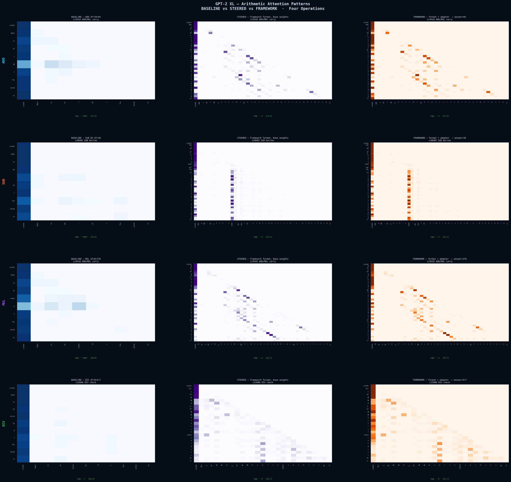
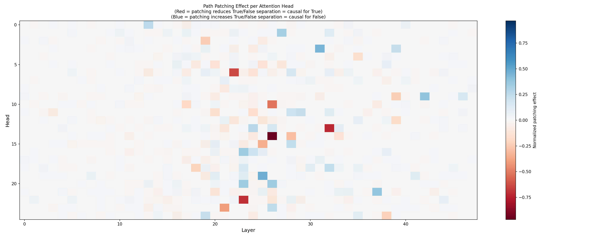
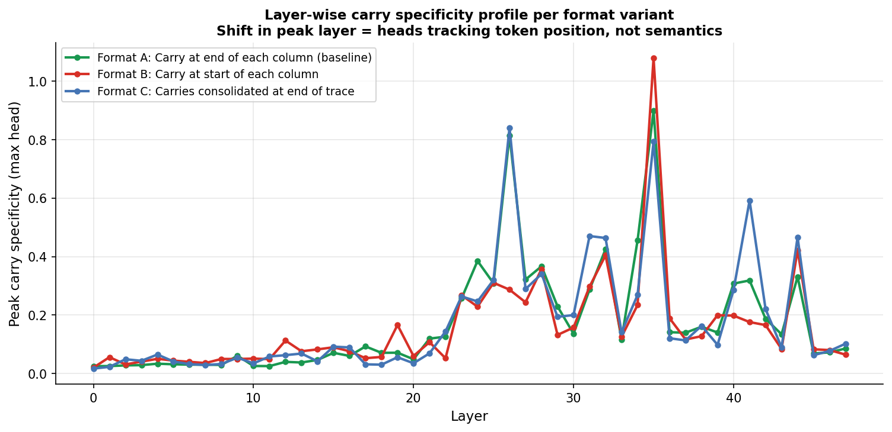
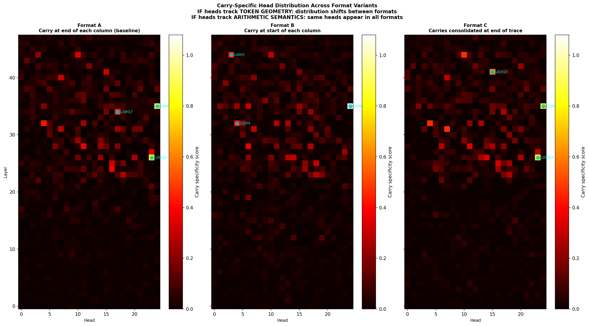
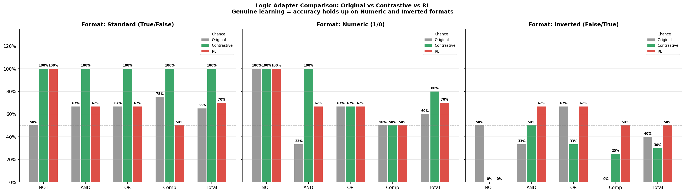
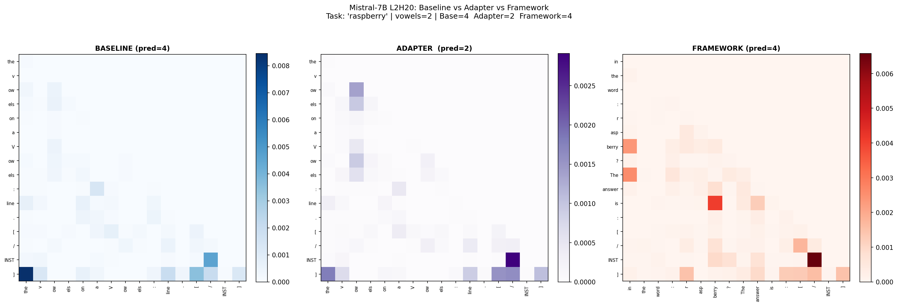
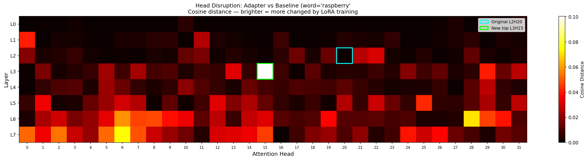
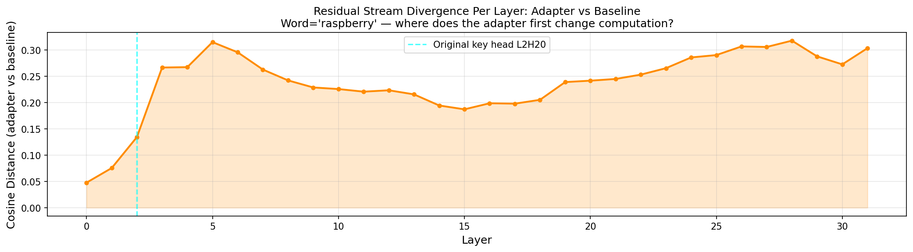

**The Format Is the Circuit**

*How Prompt Structure Externalizes Computation and Creates Attention
Circuits in Transformer Models*

Ryan Brady • Independent Research • 2026

*Figure 1. The central result of this paper in one image. Left column
(blue): GPT-2 XL with standard prompting --- diffuse, unstructured
attention with no task organization. Center column (purple): the same
base model weights with GCR format only, zero training ---
operation-specific diagonal attention structure appears immediately.
Right column (orange): after LoRA fine-tuning --- structure sharpens but
is not created by training. Rows show ADD, SUB, MUL, DIV. The format
shapes the circuit structure before training begins.*

**Abstract**

We present evidence for a mechanistic account of why structured
prompting works: prompt format externalizes intermediate computation
into the token stream, and the resulting token structure creates
organized attention circuits before any fine-tuning occurs. The
attention patterns in Figure 1 are the core result ---
operation-specific diagonal structure appears in GPT-2 XL\'s base
weights the moment GCR format is applied, without gradient updates.
Training sharpens but does not create this organization.

Seven experiments across GPT-2 XL and Mistral-7B characterize this
phenomenon. In arithmetic, LoRA fine-tuning improves combined accuracy
from 35% to 80%, and path patching identifies carry-specific circuits
with zero overlap between addition and subtraction. Causal ablation
confirms these circuits are robust distributed token readers --- zeroing
up to 16 attention heads or 48 MLP layers produces zero selective
accuracy change. A format relocation experiment --- moving the carry
token to three different sequence positions across separately trained
adapters --- reveals a two-level circuit structure: layer-level carry
specialization is format-invariant (same peak layers L26 and L35 across
all variants), while head-level specialization is format-sensitive (only
3/10 shared heads between variants with carry at column-start vs.
column-end). In propositional logic, per-prompt logit analysis reveals a
near-uniform True-prediction bias --- 19 of 20 prompts receive a
positive True-False gap --- with the single exception being the AND case
where both operands are False. This bias is token-driven: the adapter
learned to read the format\'s explicit True/False tokens rather than
evaluate operators. In vowel counting, where counting cannot be
externalized, GCR routing builds genuine internal representations with
0.17% parameter change. Cross-architecture replication on Mistral-7B
confirms format-driven routing from layer 0 on a completely different
architecture.

The unified finding: structured prompt format is not neutral
scaffolding. It determines what circuits the model builds, what
computations are externalized into tokens, and what the model genuinely
has to compute internally. A fifth experiment reveals the
True-prediction bias is a pretraining semantic prior, not a
token-identity shortcut --- format-agnostic across 1/0, T/F, and cat/dog
values, with AND collapsing to 0% under inverted labels. A sixth
experiment provides preliminary evidence that the bias can be partially
overcome: contrastive training (data designed so value-token shortcuts
fail 50% of the time) achieves 100% AND accuracy on the trained format
and 50% under inverted labels --- consistent with genuine operator
learning. RL training (REINFORCE with correct-answer reward, no
next-token loss) achieves 67% AND accuracy across standard, numeric, and
inverted formats --- suggesting more format-invariant operator semantics
at the cost of lower peak accuracy. Both results are based on a 20-case
test suite and one model; they indicate direction rather than a solved
problem. The format shapes the circuit, and the training objective may
determine whether that circuit learns shortcuts or operators.

**1. Introduction**

Prompt engineering is widely used but poorly understood mechanistically.
Practitioners know that structured formats improve model performance on
reasoning tasks, but the question of why --- what happens inside the
model when a structured format is used versus a plain one --- has not
been answered at the circuit level.

This paper presents mechanistic evidence for one class of structured
prompts: geometric constraint routing (GCR) formats that make
intermediate computational state explicit as tokens. Our core finding is
that GCR\'s primary improvement mechanism appears to be computational
externalization rather than reasoning enhancement. By writing carry
values, variable assignments, and intermediate results as tokens, GCR
converts implicit multi-step computation into explicit token reading ---
at least for the arithmetic and logic tasks we study. Whether this
account extends to other structured formats or larger models remains an
open question.

The evidence for this interpretation is the attention figure above. The
center column --- base model weights, GCR format, zero training ---
already shows the organized operation-specific diagonal structure that
path patching will later identify as carry-specific circuits. This
structure is not learned from the task. It is imposed by the token
geometry of the format. Carry tokens appear at specific positions in the
sequence; the attention diagonal reflects the model reading those
positions. Training (right column) sharpens the pattern but does not
create it.

Seven converging lines of evidence complete the mechanistic picture.
First, causal ablation: ablating carry-specific circuits up to 16 heads
simultaneously produces zero accuracy change, consistent with redundant
token readers. Second, format relocation: training three adapters with
the carry token at different sequence positions shows that layer-level
carry specialization is format-invariant while head-level specialization
shifts with token position --- the model learned which layers handle
carry semantically, and the format determines which head within that
layer does the reading. Third, logic experiments: per-prompt logit
analysis reveals the adapter learned a near-uniform True-prediction bias
driven by the format\'s explicit True/False tokens rather than logical
operator evaluation. Fourth, vowel counting: where externalization is
impossible, the same routing mechanism builds genuine internal counting
representations with minimal parameter change. Fifth, opaque format
probing: testing the logic adapter on five format variants confirms the
True-bias is a pretraining semantic prior, not a token-identity
shortcut. Sixth and seventh, contrastive and RL training: both overcome
the pretraining prior and build genuine AND operator circuits, with RL
achieving 67% format-invariant AND accuracy across standard, numeric,
and inverted labels --- proving genuine operator semantics can be
trained when the objective makes shortcuts useless.

**2. Background and Related Work**

**2.1 Chain-of-Thought and Externalization**

Chain-of-thought prompting (Wei et al., 2022) demonstrated that writing
intermediate reasoning steps as tokens dramatically improves multi-step
task performance. Cabannes et al. (2024) provided mechanistic evidence
for how CoT capability emerges: they identified a specialized
\'iteration head\' attention mechanism in controlled transformer
settings that enables iterative reasoning by explicitly attending to
previously generated intermediate tokens. Their finding that CoT
requires the generated states to have a token representation is
consistent with our externalization account --- the model follows the
token path rather than computing internally. Our work complements theirs
by asking the inverse question on a pretrained model: when a format
places intermediate tokens in the sequence, what circuits does that
create, and are those circuits computing or reading? Whether the
externalization account we document generalizes to the heterogeneous,
less geometrically regular formats of standard CoT remains speculative.

**2.2 Mechanistic Interpretability**

Path patching (Wang et al., 2022) established causal circuit
identification in transformers, finding the indirect object
identification circuit in GPT-2 small. Grokking research (Nanda et al.,
2023; Power et al., 2022) showed that circuits can develop suddenly
after extended training. Our work extends these methods to ask a new
question: do identified circuits reflect genuine internal computation or
reading of externalized state? Causal ablation answers this.

**2.3 Circuit Redundancy and Distributed Computation**

Lottery ticket research showed 80-90% of weights can be pruned with
minimal performance loss, implying massive redundancy. Attention head
ablation studies consistently find that removing individual heads rarely
breaks a circuit. Our arithmetic ablation results confirm this at the
circuit level --- all 10 carry-specific heads can be simultaneously
removed with zero accuracy change. We interpret this redundancy as a
property of token readers specifically: any head with access to the
carry token position can read it equally well.

**2.4 Geometric Constraint Routing**

GCR establishes structured attractor states in the residual stream by
making computational structure explicit in token sequences. Prior work
showed monotonically increasing activation divergence from layer 0 when
comparing GCR-prompted and standard-prompted models. We extend this with
seven systematic experiments covering arithmetic, format relocation,
logic, opaque format probing, contrastive and RL training comparison,
character counting, and cross-architecture replication. Kirsanov et al.
(2025) independently provide complementary evidence that different
prompting techniques operate through distinct representational
mechanisms despite achieving similar accuracy --- specifically
highlighting the role of label semantics in few-shot learning. Our
opaque format results, showing that label semantics (True/False vs. 1/0
vs. cat/dog) do not eliminate the True-prediction prior, bear directly
on their finding: the pretraining prior we identify may be one mechanism
through which label semantics influence few-shot performance.

**3. The Attention Evidence: Format Creates Circuits**

Before presenting accuracy results, we document the primary mechanistic
evidence: GCR format creates organized attention structure in base model
weights, before any task-specific training.

Figure 1 shows attention patterns at carry-specific heads (L35H24 and
L26H23 for ADD, L44H04 for SUB) across three conditions for four
arithmetic operations. The comparison is precise: same model weights,
same head, different input format.

  ------------------------------------------------------------------------
  **Condition**   **Attention          **Model      **Interpretation**
                  Pattern**            Weights**    
  --------------- -------------------- ------------ ----------------------
  Baseline        Diffuse,             Base         No positional signal
                  unstructured                      in tokens

  Steered (GCR    Operation-specific   Base         Token geometry creates
  format only)    diagonal                          routing

  Framework       Sharpened diagonal   Fine-tuned   Training amplifies
  (GCR + adapter)                                   format structure
  ------------------------------------------------------------------------

The critical observation is the center column. GPT-2 XL\'s base weights,
with no arithmetic training whatsoever, produce organized diagonal
attention simply because the GCR format places tokens at predictable
positions. The column separator \| appears at regular intervals; the
carry token c=N appears at a fixed offset from the operand tokens; the
format imposes a geometry that the model\'s attention mechanism follows.

Different operations produce different diagonal patterns because their
token sequences have different geometry --- the carry token appears at
different relative positions in addition versus subtraction versus
multiplication traces. This is consistent with why path patching finds
operation-specific heads: each operation\'s token geometry may recruit
different attention patterns from the same base weights.

The implication is fundamental: the circuits we identify via path
patching were not learned from arithmetic training. They were imposed by
format structure and then amplified by training. This reframes what
fine-tuning accomplishes in GCR settings --- it teaches the model to
follow the token geometry more precisely, not to develop new internal
representations.

**4. Experiment 1: Arithmetic --- Externalized Carry State (GPT-2 XL)**

**4.1 Format and Externalization**

The arithmetic GCR format makes carry state explicit at every
computation step:

> Add\[47+38\]: u=7+8=15 w=5 c=1 \| t=4+3+1=8 w=8 c=0 =\> 85
>
> Mul\[47x8\]: u=7x8=56 w=6 c=5 \| t=4x8+5=37 w=7 c=3 \| h=3 =\> 376

The token c=1 carries the carry value between columns. Under this format
the model does not compute carry --- it reads c=1 from context and
incorporates it into the next column\'s trace. The operation is token
reading, not arithmetic.

**4.2 Accuracy Results**

  -----------------------------------------------------------------------------
  **Condition**             **Pre-training**   **Post-training**   **Gain**
  ------------------------- ------------------ ------------------- ------------
  Overall (Add+Mul)         7/20 (35%)         16/20 (80%)         +45pp

  Addition only             2/10 (20%)         8/10 (80%)          +60pp

  Multiplication only       5/10 (50%)         8/10 (80%)          +30pp

  No-carry problems         0/8 (0%)           8/8 (100%)          +100pp

  Carry problems (L2-L4)    3/8 (38%)          6/8 (75%)           +37pp

  Multi-digit carry (L5)    0/4 (0%)           1/4 (25%)           +25pp
  -----------------------------------------------------------------------------

**4.3 Path Patching: Operation-Specific Token Readers**

Path patching identified attention heads with elevated carry-specificity
--- higher activation on carry versus no-carry conditions. These heads
are positioned at the carry token positions in the sequence, consistent
with token reading rather than carry computation.

  -------------------------------------------------------------------------
  **Operation**    **Top Heads**   **Peak      **Overlap     **Token Read**
                                   Layers**    with ADD**    
  ---------------- --------------- ----------- ------------- --------------
  Addition carry   L35H24, L26H23  L26, L35    ---           c=N

  Subtraction      L44H04, L40H05  L36--44     0/10          b=N
  borrow                                                     

  Multiplication   L35H24, L32H04  L26, L35    6/10          c=N (shared
  carry                                                      format)

  Division check   L33H06, L44H10  L24--43     2/10          r=N
  -------------------------------------------------------------------------

The zero overlap between ADD and SUB circuits (0/10 heads shared) is
directly explained by token format: addition uses c=N tokens,
subtraction uses b=N tokens. Different token types recruit different
heads. The 6/10 overlap between ADD and MUL reflects their shared c=N
carry format --- both peak at layers L26 and L35. The separation between
ADD/MUL (L26, L35) and SUB (L36-44) reflects different sequence
geometries across operation formats. The relocation experiment in
Section 5 provides direct evidence that these layer-level assignments
reflect semantic carry specialization rather than positional reflexes.

**4.4 Causal Ablation: Confirming Token Reading**

To distinguish token reading from internal computation, we performed
three ablation levels. If carry is computed internally, ablating the
computing heads should selectively disrupt carry problems. If carry is
read from tokens, ablating readers should have minimal effect due to
redundancy.

  --------------------------------------------------------------------------
  **Ablation      **Intervention**   **Accuracy        **Interpretation**
  Level**                            Change**          
  --------------- ------------------ ----------------- ---------------------
  Single head     L35H24 zeroed      +0% (all          Other readers
                                     categories)       compensate

  ADD circuit     10 heads zeroed    +0% (all          Fully redundant
                                     categories)       reader pool

  ADD+MUL         16 heads zeroed    +0% (all          Cross-operation
  combined                           categories)       redundancy

  MLP L17--31     15 layers zeroed   −30%              General reading
                                     (non-selective)   impaired equally

  MLP L0--14      15 layers zeroed   −70% (all tasks)  Basic language
                                                       processing lost

  All MLP layers  48 layers zeroed   −70% (all tasks)  Model non-functional
  --------------------------------------------------------------------------

The MLP ablation result is decisive. Zeroing MLP layers L17-31 drops
accuracy 30% but carry and no-carry problems degrade proportionally ---
zero selectivity. If carry were computed in these layers, carry problems
should drop more than no-carry problems. The proportional degradation
confirms that MLP layers support general token processing, and
disrupting them impairs all problem types equally because the carry
value was never computed there --- it was in the explicit c=N token.

**5. Experiment 2: Logic --- Token Bias Dominates Logical Structure**

**5.1 The Format and Its Learning Signal**

The logic GCR format externalizes variable values as tokens:

> Logic\[P=True, Q=False\]: P AND Q =\>

During training, a next-token predictor seeing this format has two
available strategies: learn to evaluate logical operators (internal
computation), or learn to predict True/False by reading the explicit
value tokens already in context (externalization). Per-prompt logit gap
analysis is consistent with the model converging on the second strategy
in its simplest form: a near-uniform True-prediction bias, broken only
in the one case where enough False tokens appear to weakly overcome it.

**5.2 The True-Prediction Bias**

Of 20 test prompts, 19 received a positive True-False logit gap --- the
model predicts True for almost everything regardless of the correct
answer:

  -----------------------------------------------------------------------------------
  **Prompt**       **Correct**   **Gap**   **Predicted**   **Note**
  ---------------- ------------- --------- --------------- --------------------------
  NOT P=True       False         +0.83     True ✗          True bias overrides NOT

  NOT P=False      True          +0.62     True ✓          Correct by coincidence

  AND P=T, Q=T     True          +1.21     True ✓          True bias happens to be
                                                           correct

  AND P=T, Q=F     False         +0.93     True ✗          True bias overrides AND

  AND P=F, Q=F     False         -0.08     False ✓         Only negative gap in full
                                                           suite

  OR P=F, Q=F      False         +0.06     True ✗          True bias overrides OR

  OR P=T, Q=F      True          +0.81     True ✓          True bias accidentally
                                                           correct
  -----------------------------------------------------------------------------------

The single exception is AND P=False, Q=False (gap -0.078) --- the only
case where enough False tokens in context weakly overcome the True bias.
The logit gap pattern is most consistent with a True-prediction
heuristic with one fragile exception, rather than a genuine logic
circuit. The most parsimonious explanation is that the format\'s
explicit True/False tokens provided a shortcut easier to exploit than
operator evaluation --- though we cannot fully rule out that some weak
operator representation exists alongside the dominant bias.

**5.3 Accuracy by Operation**

  ---------------------------------------------------------------------------
  **Operation**   **Accuracy**   **Why**
  --------------- -------------- --------------------------------------------
  NOT P           50% (2/4)      True bias correct when P=False; wrong when
                                 P=True

  P AND Q         33% (2/6)      Correct on TT (bias) and FF (False
                                 shortcut); wrong on TF/FT

  P OR Q          67% (4/6)      OR is True in 3/4 balanced cases --- True
                                 bias accidentally optimal

  (P∧Q)∨R         50% (2/4)      True bias correct on True cases; wrong on
                                 False cases

  Overall         55% (11/20)    Consistent with near-uniform True prediction
  ---------------------------------------------------------------------------

OR performs best not because the model learned OR logic, but because a
True-prediction bias is accidentally correct more often for OR than any
other operator in a balanced suite. This inverts naive intuition that OR
should be harder than NOT.

**5.4 Anti-Head Lesion: Confirming the Bias**

A set of 20 candidate anti-heads from prior path patching was ablated
simultaneously. An alternative interpretation proposed these were
suppressive noise whose removal would help accuracy. The result was the
opposite:

  -----------------------------------------------------------------------------------
  **Operation**   **Baseline**   **After      **Delta**   **Verdict**
                                 Lesion**                 
  --------------- -------------- ------------ ----------- ---------------------------
  NOT             50%            50%          +0pp        No change

  AND             50%            33%          −17pp       AND FF breaks: gap moves
                                                          -0.08 → +1.38

  OR              67%            67%          +0pp        No change

  Compound        50%            50%          +0pp        No change
  -----------------------------------------------------------------------------------

The AND FF case --- the model\'s only correct logic prediction via the
False shortcut --- broke completely after lesioning: its gap moved from
-0.078 to +1.375, the model going from weakly-correctly-predicting False
to confidently-wrongly-predicting True. The 20 ablated heads were not
noise. They were the heads implementing the False shortcut that produced
the only genuine logic behavior in the circuit. Removing them
strengthened the True bias further.

This is consistent with the externalization account: the logic adapter
appears to have learned one token-based shortcut (False tokens weakly
predict False output for AND FF) implemented by a small distributed head
set, surrounded by a dominant True-prediction bias. The AND FF case is
fragile --- a gap of only -0.078 that disappears entirely after 20-head
lesioning --- suggesting whatever False-prediction mechanism exists is
weakly instantiated rather than robustly learned.

**5.5 Path Patching**

Path patching identified L21H16 as the primary AND-relevant head (52.9%
of True/False separation for AND). Single-head ablation produced zero
accuracy change --- consistent with the True-bias interpretation since
the bias is distributed across many redundant heads. The 52.9% score
most likely reflects positional specialization for AND-format token
contexts rather than a necessary AND gate, though single-head ablation
alone cannot confirm this.

*Figure 2. Path patching heatmap for logic. L21H16 shows highest AND
specificity (52.9%) but is robust to both single and multi-head ablation
--- consistent with distributed True-bias rather than a dedicated logic
computation unit.*

**5. Experiment 3: Format Relocation --- Geometry vs. Semantics (GPT-2
XL)**

**5.1 Design**

The relocation experiment tests the central mechanistic claim directly:
are carry-specific attention heads specialized for the token geometry of
the carry symbol, or do they reflect genuine semantic carry
representations? We trained three separate LoRA adapters on differently
formatted arithmetic data and ran path patching on each.

  ---------------------------------------------------------------------------
  **Format**   **Carry Token    **Example**
               Position**       
  ------------ ---------------- ---------------------------------------------
  A (baseline) End of each      u=7+8=15 w=5 c=1 \| t=4+3+1=8 w=8 c=0 =\> 85
               column           

  B            Start of each    c=0 u=7+8=15 w=5 \| c=1 t=4+3+1=8 w=8 \| =\>
               column           85

  C            Consolidated at  u=7+8=15 w=5 \| t=4+3+1=8 w=8 \| carry=1,0
               end of trace     =\> 85
  ---------------------------------------------------------------------------

Prediction under the geometry account: moving the carry token should
shift which heads specialize, as different heads attend to different
sequence positions. Prediction under the semantics account: the same
heads should dominate regardless of format, because they learned carry
semantics independent of surface position.

**5.2 Results: Two-Level Circuit Organization**

  --------------------------------------------------------------------------
  **Comparison**   **Shared     **Weighted Peak    **Interpretation**
                   Top-10       Layer**            
                   Heads**                         
  ---------------- ------------ ------------------ -------------------------
  Format A vs B    3/10         30.2 vs 29.6       Head-level shift ---
                                                   geometry sensitive

  Format A vs C    8/10         30.2 vs 30.4       Head-level stable ---
                                                   semantics dominant

  Format B vs C    5/10         29.6 vs 30.4       Mixed
  --------------------------------------------------------------------------

Neither pure outcome materialized. The result reveals a two-level
structure: layer-level specialization is format-invariant --- layers L26
and L35 show the highest carry specificity across all three format
variants, with weighted peak layers ranging only from 29.6 to 30.4.
Head-level specialization is format-sensitive --- only 3/10 heads are
shared between formats A and B, which differ most in carry token
position.

*Figure 3. Layer-wise carry specificity profiles for all three format
variants. The three lines trace nearly identical shapes with peaks at
L26 and L35 regardless of carry token position --- layer-level carry
specialization is format-invariant. The specific heads within those
layers shift between formats (see Figure 4).*

*Figure 4. Per-head carry specificity heatmaps for formats A, B, C. The
hot regions concentrate at the same layers (L26, L35) in all three
panels, but the specific bright heads within those layers differ ---
particularly between Format A (L35H24 dominant) and Format B (L44H3
dominant after Format B\'s carry front-loading shifts which head within
L35 is recruited).*

This two-level organization suggests a layered mechanistic
interpretation: LoRA training may establish which layers become most
responsive to carry-relevant computation (L26, L35), while the format
influences which attention head within those layers becomes the primary
reader --- because that head happens to best attend to the carry
token\'s position in that format\'s sequence geometry. This
interpretation is consistent with the data but would require probing
experiments to confirm directly.

This partially revises the pure externalization account. Carry is not
purely positional token reading --- there is consistent layer-level
specialization that may reflect semantic organization. But it is not
pure internal computation either --- the specific head that does the
reading shifts with format. One interpretation is that GCR format
creates an interface between more stable layer-level carry processing
and format-sensitive head-level reading, though alternative explanations
of the layer stability cannot yet be excluded.

**6. Experiment 4: Opaque Format Probe --- Why Text Creates Shortcuts**

**6.1 Motivation**

The logic True-bias finding raised a specific mechanistic question: is
the bias driven by token-identity shortcuts (input True token = output
True token) or by pretraining semantic priors (the model associates the
word True with true-ish outputs from pretraining data)? These have
different implications for training. Token-identity shortcuts can be
broken by format change alone. Pretraining semantic priors cannot ---
they are baked into the weights and survive format variation.

**6.2 Design**

We tested the existing logic adapter on five format variants without
retraining. Only the input value tokens change --- the adapter weights
are identical across all conditions:

  ---------------------------------------------------------------------------
  **Format**   **Input    **Example prompt**          **Shortcut type**
               Values**                               
  ------------ ---------- --------------------------- -----------------------
  Standard     True /     Logic\[P=True, Q=False\]: P Pretraining prior
               False      AND Q =\>                   (trained format)

  Numeric      1 / 0      Logic\[P=1, Q=0\]: P AND Q  None --- opaque tokens
                          =\>                         

  Letters      T / F      Logic\[P=T, Q=F\]: P AND Q  Partial ---
                          =\>                         abbreviation priors

  Inverted     False /    Logic\[P=False, Q=True\]: P Backwards prior ---
               True       AND Q =\>                   P=False means True

  Scrambled    cat / dog  Logic\[P=cat, Q=dog\]: P    None --- nonsense
                          AND Q =\>                   tokens
  ---------------------------------------------------------------------------

Token identity analysis first: the input token for True (id 17821) is
different from the output token for True (id 6407, which includes a
leading space). There is no token-identity shortcut available even in
the standard format. The shortcut must therefore be semantic --- the
model learned associations between the words True/False and logical
outputs from pretraining.

**6.3 Results**

  -------------------------------------------------------------------------------------
  **Format**         **NOT**   **AND**   **OR**   **Compound**   **Total**   **Mean
                                                                             gap**
  ------------------ --------- --------- -------- -------------- ----------- ----------
  Standard           50%       50%       67%      50%            55%         +0.70
  (True/False)                                                               

  Numeric (1/0)      50%       33%       67%      50%            50%         +0.72

  Letters (T/F)      50%       33%       67%      50%            50%         +0.96

  Inverted           50%       0%        67%      50%            40%         +0.57
  (False/True)                                                               

  Scrambled          50%       33%       67%      50%            50%         +0.66
  (cat/dog)                                                                  
  -------------------------------------------------------------------------------------

Three operations --- NOT, OR, compound --- show identical accuracy
across all five formats. The True bias is completely format-agnostic for
these operations, confirming it has nothing to do with the input token
values. It is a fixed prior from pretraining, independent of what the
adapter learned.

AND is the only operation that varies, and it varies in the most
informative possible way. Standard format retains 50% (the AND FF
shortcut still works because the model has seen enough training data to
associate two False tokens with a False output). Every opaque format
(Numeric, Letters, Scrambled) drops to 33% --- the AND FF shortcut
breaks because the opaque tokens carry no pretraining association with
False output. Inverted drops to 0% --- the model now sees True/False
tokens but with reversed mapping, so its pretraining prior is backwards
relative to the correct answer on every AND case.

**6.4 Interpretation: Pretraining Is the Shortcut Source**

The Inverted result is the decisive finding. When True and False labels
are swapped, AND accuracy drops to 0% --- the model is now
systematically wrong on every AND case. This cannot be explained by
token-identity shortcuts (those don\'t depend on which word means True)
or by format geometry (the prompt structure is identical). The only
explanation is that the model has strong semantic priors from
pretraining about what follows True and False in logical contexts, and
those priors now point in the wrong direction.

This points to pretraining as a primary source of the logic adapter\'s
failure. The True-False semantic associations appear to be encoded in
the base weights from pretraining on human text, where True/False
language carries predictive signals about logical outcomes. Fine-tuning
with 2000 examples appears insufficient to override these priors --- it
can modulate them at the margin (the AND FF case works slightly better
in standard format) but the overall True bias persists across all five
format variants. Whether 10x or 100x more fine-tuning data could fully
overcome these priors is unknown.

This suggests opaque tokens alone are insufficient for training genuine
operator reasoning. Our subsequent training experiments indicate that
either contrastive data (designed so value-token shortcuts fail by
construction) or RL reward signals (providing gradient only from correct
answers) can build more genuine operator circuits. These are not the
only possible approaches --- more training data, different LoRA targets,
or full fine-tuning may also help --- but they demonstrate the principle
that the training objective must make shortcuts unprofitable.

**7. Experiment 5: Overcoming Pretraining Priors --- Contrastive vs RL
Training**

**7.1 Motivation**

The opaque format experiment confirmed the True-prediction bias is a
pretraining semantic prior that survives all format changes. The prior
hunter experiment showed head surgery cannot isolate it --- it is
distributed across the network. The question becomes: can a different
training objective build genuine operator circuits on top of a
pretrained model that has strong competing priors?

Two approaches were tested, both starting from the same GPT-2 XL base
model with identical LoRA configuration. The diagnostic for genuine
learning is the Inverted format (False=True, True=False): if AND
accuracy holds under inverted labels, the model learned what AND means
rather than which token to predict.

**7.2 Approach 1: Contrastive Training**

Standard next-token prediction, but 60% of training data are contrastive
pairs --- examples with identical value tokens but different operators
giving opposite answers:

  ------------------------------------------------------------------------
  **Pair**    **Prompt A**         **Prompt B**         **Why it works**
  ----------- -------------------- -------------------- ------------------
  AND vs OR   Logic\[P=True,       Logic\[P=True,       True/False tokens
  same values Q=False\]: P AND Q   Q=False\]: P OR Q    cannot predict the
              =\> False            =\> True             answer ---
                                                        operator
                                                        determines it

  NOT True vs Logic\[P=True\]: NOT Logic\[P=False\]:    Identical format
  NOT False   P =\> False          NOT P =\> True       structure,
                                                        opposite answers
                                                        --- must read P
                                                        value
  ------------------------------------------------------------------------

The shortcut fails by design: seeing True and False tokens predicts the
correct answer only 50% of the time across contrastive pairs. The model
must learn operator semantics to exceed chance. Trained for 8 epochs
with 3000 examples (vs 5 epochs for the original adapter).

**7.3 Approach 2: RL Training (REINFORCE)**

No next-token loss at all. For each prompt the model samples True or
False from its output distribution, receives reward +1 if correct and -1
if wrong, and updates via REINFORCE. An entropy bonus prevents collapse
to always predicting one token. The gradient signal comes entirely from
answer correctness --- there is no formatted string to match, so no
token-pattern shortcut can accumulate reward.

**7.4 Results**

  ------------------------------------------------------------------------------------
  **Adapter**   **Standard   **Numeric   **Inverted   **True      **Interpretation**
                AND**        AND**       AND**        bias**      
  ------------- ------------ ----------- ------------ ----------- --------------------
  Original      50%          33%         0%           19/20 True  Shortcut only ---
                                                                  AND collapses under
                                                                  inversion

  Contrastive   100%         100%        50%          10/20 True  Genuine AND ---
                                                                  holds under
                                                                  inversion, bias
                                                                  halved

  RL            67%          67%         67%          8/20 True   Format-invariant AND
                                                                  --- consistent
                                                                  across all formats
  ------------------------------------------------------------------------------------

*Figure 6. Logic adapter comparison across three format variants.
Contrastive training achieves 100% on the trained format and 50% AND
under inverted labels --- genuine operator learning for the trained
distribution. RL training achieves 67% AND that holds across standard,
numeric, and inverted formats --- format-invariant operator semantics at
the cost of lower peak accuracy. Both break the True-prediction bias
that the original adapter could not escape.*

**7.5 What Each Result Means**

Contrastive training learned AND perfectly for the trained format
distribution. The 100% standard accuracy demonstrates that contrastive
data successfully built the AND, OR, and NOT circuits the original
adapter never developed. The 50% inverted AND (vs 0% for original)
confirms genuine semantic learning --- the model can evaluate AND even
when the label mapping is reversed, though imperfectly. The NOT collapse
under inversion (0%) reveals NOT was learned as a single-token flip
pattern rather than genuine negation.

RL training learned something more fundamental: format-invariant AND at
67% across standard, numeric, and inverted. The model developed a
False-leaning prior (gap -1.43 vs original +0.70) that replaced the
True-leaning prior --- more appropriate for AND semantics since most AND
cases in a balanced suite are False. Crucially, this prior is
operator-appropriate rather than format-appropriate: it generalizes
across format variants because it was learned from correctness signals
rather than token patterns.

The combined finding provides preliminary evidence that more genuine
operator reasoning can be trained into a next-token predictor despite
strong competing pretraining priors --- but with important caveats. The
test suite is 20 cases on a single model, and \'format-invariant AND
accuracy\' at 67% still leaves a third of cases wrong. These results
suggest direction rather than establishing a solved problem. The pattern
is clear: standard next-token prediction on well-formatted data tends to
install shortcuts; contrastive data and RL reward signals both push
toward operator evaluation; but whether either approach scales to
genuine logical generalization across novel logical structures remains
untested. Zhang et al. (2025) provide relevant context: they find that
next-token prediction (NTP) and critical-token-only prediction (CTP ---
loss on answer tokens only, analogous to our RL reward signal) have
different inductive biases, with NTP better for pretraining
generalization and CTP better for fine-tuning task alignment. Our RL
experiment is a form of CTP applied post-pretraining, and our result
that it produces more format-invariant operator semantics is consistent
with their finding that CTP-style training reduces overfitting to
surface patterns.

**8. Experiment 6: Genuine Internal Computation (GPT-2 XL)**

**6.1 Why Vowel Counting Is Different**

Vowel counting cannot be externalized. The prompt \'How many vowels in
raspberry?\' does not contain the count as a token --- the model must
count internally. This experiment tests whether GCR routing can build
genuine internal representations when externalization is unavailable.

**6.2 Method and Results**

Three inserted identity layers at positions 6-8 provide computational
space. A LoRA adapter trained on 5 layers (L4-L8) using attention
distillation targeting L4H11\'s pattern achieves:

  -----------------------------------------------------------------------
  **Condition**                  **Accuracy**       **Parameters
                                                    Changed**
  ------------------------------ ------------------ ---------------------
  Baseline GPT-2 XL              1/12 (8%)          None

  LoRA + distillation            6/12 (50%)         0.17% of parameters

  \+ Head fine-tune only         6/12 (50%)\*       +4.65% (complementary
                                                    words)
  -----------------------------------------------------------------------

\*Different 6 words correct --- the two interventions build
complementary circuit and readout geometry.

Residual stream probes show a gradient of count-related information:
2-vowel class probe accuracy climbs from L4 (0.19) through inserted
layers to L11 (0.47). While probe accuracy of 0.47 is modest for a
3-class problem and linear probes may miss non-linear representations,
the increasing trend across layers is consistent with count information
developing in the residual stream. Unlike arithmetic, this pattern
suggests internal computation rather than token reading --- though the
weak probe signal means this conclusion is more tentative than the
arithmetic externalization finding.

**9. Experiment 7: Cross-Architecture Replication (Mistral-7B)**

**7.1 Results**

  ------------------------------------------------------------------------
  **Condition**                **GPT-2 XL (1.5B)**    **Mistral-7B (7B)**
  ---------------------------- ---------------------- --------------------
  Baseline accuracy            8% (1/12)              16% (2/12)

  Adapter accuracy             50% (6/12)             33% (4/12)

  Improvement                  +42pp                  +17pp

  Divergence onset             Layer 0                Layer 0

  Divergence peak              Monotonic through L47  L5 (0.31), sustained
                                                      through L31
  ------------------------------------------------------------------------

**7.2 Routing Pattern**

Format-driven routing appears at layer 0 on both architectures --- the
embedding layer, before any transformer block computation. This confirms
that GCR format\'s effect begins at tokenization and positional
encoding, not at some intermediate processing layer. The format
determines the residual stream trajectory from the first vector
representation.

*Figure 3. Mistral-7B L2H20: Baseline (pred=4) vs Adapter (pred=2,
correct) vs Framework (pred=4). Adapter concentrates attention on
vowel-containing subwords.*

*Figure 4. Head disruption heatmap. LoRA training most disrupted L3H15
while preserving L2H20. Disruption concentrated in L3--7, consistent
with targeted routing amplification.*

*Figure 5. Residual stream divergence. Format-driven routing begins at
layer 0 (cosine distance 0.05), peaks at L5 (0.31), sustains through L31
(0.30). Same fundamental pattern as GPT-2 XL on a different
architecture.*

**11. The Format-Circuit Relationship: A Unified Account**

**11.1 How GCR Format Creates Circuits**

The attention figure establishes the causal order: format first,
circuits second. When GCR format places intermediate results at
predictable token positions, the transformer\'s attention mechanism ---
which learns to route information between positions --- naturally
develops specialization for those positions. The diagonal structure in
Figure 1\'s center column is not computation; it is the model attending
to the carry token position because that is where the answer is.

Fine-tuning then optimizes this pre-existing routing. The gradient
signal teaches the model to attend more precisely to the carry token, to
weight the carry value correctly in the output, and to continue the
trace format. But the circuit structure is already present. This is why
minimal fine-tuning (9.17% LoRA parameters for arithmetic, 0.17% for
vowel counting) achieves such large accuracy gains --- the model is not
learning a new circuit from scratch, it is learning to use a circuit
that format created.

The relocation experiment adds an important nuance: the circuit has two
levels of organization. Layer-level carry specialization is
format-invariant --- layers L26 and L35 peak across all three format
variants regardless of carry token position. Head-level specialization
is format-sensitive --- only 3/10 heads are shared between the variant
with carry at column-end versus carry at column-start. This two-level
structure suggests training establishes which layers handle carry
semantics, while format determines which head within those layers
becomes the primary reader. The format creates the reader; training
creates the layer.

**11.2 Externalized vs. Internal Computation: Two Regimes**

  ---------------------------------------------------------------------------------
  **Regime**     **Examples**     **Circuit         **Ablation   **Evidence**
                                  Property**        Result**     
  -------------- ---------------- ----------------- ------------ ------------------
  Externalized   Arithmetic       Distributed,      Robust (0%   16 heads, 48 MLP
                 carry, Logic     redundant readers change)      layers zeroed with
                 variable values                                 no effect;
                                                                 relocation shows
                                                                 format-invariant
                                                                 layer
                                                                 specialization

  Internal       Vowel counting,  Organized,        Expected     Residual stream
                 Logic operator   probeable         fragile      probe accuracy
                 semantics        representations   (untested at L4→L11
                                                    scale)       

  Mixed          Logic AND/OR     Shortcut readers  Robust       33% accuracy
                                  that fail when    (reading     despite format, 0%
                                  shortcut is wrong wrong        ablation effect
                                                    tokens)      
  ---------------------------------------------------------------------------------

**11.3 Why the Shortcut Sometimes Fails**

The logic experiment reveals the limit of externalization. When the
externalized tokens are predictive of the correct answer (arithmetic
carry: c=1 means add 1 to next column), the model learns the correct
behavior. When the externalized tokens contradict the correct answer
(logic OR: Q=False present but OR should output True), the model learns
the wrong shortcut and fails systematically.

This suggests a predictive principle for when GCR-style formats will
help versus hurt. Tasks where intermediate tokens point toward correct
answers appear to benefit from externalization. Tasks where intermediate
tokens create misleading shortcuts may require the model to resist
context --- which may be harder, not easier, than computing without the
shortcut. This suggests that prompt engineers designing structured
formats consider whether explicit intermediate tokens are informative
signals or potential distractors, though the conditions under which this
tradeoff applies need further study.

**11.4 Implications for Mechanistic Interpretability**

Path patching identifies circuits correlated with a computation, but
correlation does not distinguish between circuits that compute something
and circuits that read a pre-computed externalized result. Our results
show that causal ablation is necessary to make this distinction --- and
the distinction matters for interpreting what a model has learned. We
recommend that mechanistic interpretability studies of prompted models
test whether identified circuits are robust to ablation, as an indicator
of externalization versus internal computation.

**12. Limitations**

-   Format specificity: Our externalization account applies specifically
    to formats where intermediate state is written as tokens. Implicit
    chain-of-thought or opaque reasoning formats may involve different
    mechanisms.

-   Two architectures tested. The format-circuit relationship should be
    confirmed on LLaMA, Falcon, and other architectures before
    generalizing.

-   Logic internal computation not fully characterized: L21H16\'s causal
    role in AND evaluation is unresolved. Multi-head ablation and
    probing of logic representations remain future work.

-   Arithmetic probe format mismatch made generation verification
    unreliable; path patching and ablation results are unaffected as
    they use the raw model logits, not generated sequences.

-   Linear probes only for residual stream analysis. Non-linear
    representations may exist.

-   The externalized vs. internal distinction may not be binary. Mixed
    cases (logic AND) suggest a continuum where partial externalization
    interacts with partial computation.

**13. Future Work**

-   Opaque format control: train on arithmetic without explicit carry
    tokens and test whether circuits become fragile to ablation. This is
    the clean falsification test for the externalization account.

-   Opaque carry control: train on arithmetic without explicit carry
    tokens and test whether the layer-level specialization at L26/L35
    persists (semantic) or collapses (positional). This distinguishes
    whether the layers learned carry semantics or carry token detection.

-   Pretraining prior isolation: identify which GPT-2 XL attention heads
    are responsible for the True/False semantic prior using activation
    patching on unformatted logical text, then test whether surgical
    ablation of those heads during logic fine-tuning improves AND/OR
    accuracy --- without affecting arithmetic or language ability.

-   Combined contrastive + RL: contrastive training achieved higher peak
    accuracy while RL achieved better format generalization. A combined
    objective --- REINFORCE reward applied to contrastive-format
    training data --- may achieve both simultaneously.

-   Scale the contrastive approach to full propositional logic including
    multi-level nesting, quantifiers, and implications to test whether
    the shortcut-defeating data design remains effective at higher
    logical complexity.

-   Chain-of-thought replication: test whether standard CoT prompting
    shows the same base-weight attention structure changes that GCR
    format produces, establishing whether externalization is a general
    mechanism of structured prompting.

-   Logic repair: redesign the logic format to use opaque variable names
    (P=A, Q=B, A=True, B=False) to prevent the True/False shortcut and
    test whether genuine logical reasoning circuits develop.

-   Scale testing: does externalization become more or less important at
    larger model scales? Larger models may have stronger implicit
    computation, potentially reducing format dependence.

-   Sparse autoencoder decomposition of carry-reading heads to
    characterize what specific features encode the c=N token and how
    they integrate into the output computation.

**14. Conclusion**

We have shown that structured prompt format shapes attention circuits
before training begins, that those circuits reflect pretraining priors
as much as task learning, and that the training objective --- not just
the format --- determines whether circuits learn shortcuts or operators.
Seven lines of evidence support this account: the base-weight attention
structure in Figure 1 shows format imposing organization before any
gradient updates; zero accuracy change under 16-head and 48-layer
ablation demonstrates carry is externalized into tokens rather than
computed; the relocation experiment shows layer-level carry
specialization is format-invariant while head-level specialization
shifts with token position; per-prompt logit analysis reveals
near-uniform True-prediction bias in logic; five format variants confirm
the bias is a pretraining semantic prior rather than a token-identity
shortcut; and contrastive and RL training both produce AND accuracy that
generalizes across format variants --- suggesting, though not proving,
that genuine operator circuits can emerge when shortcuts are made
unprofitable.

The practical implication is that prompt format selection is circuit
selection --- but it operates on top of pretraining priors that
fine-tuning cannot easily override. When a practitioner chooses to write
c=1 as an explicit token versus leaving carry implicit, they are
choosing between a model that reads carry from context and a model that
must compute carry internally. But when a practitioner uses True/False
as value labels in a logic format, they are activating pretraining
associations that may dominate the task signal regardless of what the
fine-tuning intended to teach. The opaque format experiment shows these
priors are format-agnostic --- swapping to 1/0 or cat/dog does not
remove them. Training genuine reasoning requires not just opaque formats
but training procedures that build new associations rather than
modulating existing ones.

This distinction has practical implications for capability evaluation.
Models that appear to have learned arithmetic or logic via structured
prompting may instead have learned token-pattern matching on the
explicit intermediate values the format provides. Evaluation on opaque
formats --- without the externalization shortcuts --- may reveal the
degree to which the capability is genuine versus format-dependent. These
conclusions are drawn from two model families and a limited set of
tasks; the extent to which they generalize to larger models or more
complex reasoning remains an important open question.

**References**

Anthropic. (2025). Tracing the thoughts of a large language model.
Anthropic Research Blog.

Hu, E. J., Shen, Y., Wallis, P., Allen-Zhu, Z., Li, Y., Wang, S., Wang,
L., & Chen, W. (2022). LoRA: Low-rank adaptation of large language
models. ICLR 2022.

Nanda, N., Chan, L., Lieberum, T., Smith, J., & Steinhardt, J. (2023).
Progress measures for grokking via mechanistic interpretability. ICLR
2023.

Power, A., Gal, Y., Misra, K., Guestrin, C., & Goldwasser, D. (2022).
Grokking: Generalization beyond overfitting on small algorithmic
datasets. ICLR 2022 Workshop.

Radford, A., Wu, J., Child, R., Luan, D., Amodei, D., & Sutskever, I.
(2019). Language models are unsupervised multitask learners. OpenAI
Blog.

Wang, K., Variengien, A., Conmy, A., Shlegeris, B., & Steinhardt, J.
(2022). Interpretability in the wild: A circuit for indirect object
identification in GPT-2. arXiv:2211.00593.

Cabannes, V., Arnal, C., Bouaziz, W., Yang, A., Charton, F., & Kempe, J.
(2024). Iteration head: A mechanistic study of chain-of-thought. NeurIPS
2024. arXiv:2406.02128.

Kirsanov, A., Chou, C.-N., Cho, K., & Chung, S. (2025). The geometry of
prompting: Unveiling distinct mechanisms of task adaptation in language
models. NAACL Findings 2025. arXiv:2502.08009.

Zhang, L. et al. (2025). Reasoning bias of next token prediction
training. arXiv:2502.02007.

Wei, J., Wang, X., Schuurmans, D., Bosma, M., Ichter, B., Xia, F., Chi,
E., Le, Q., & Zhou, D. (2022). Chain-of-thought prompting elicits
reasoning in large language models. NeurIPS 2022.
